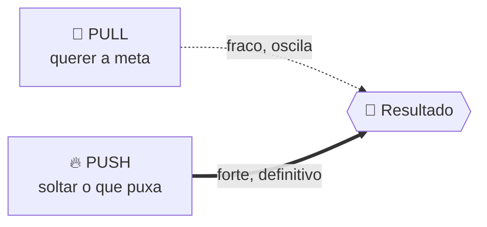
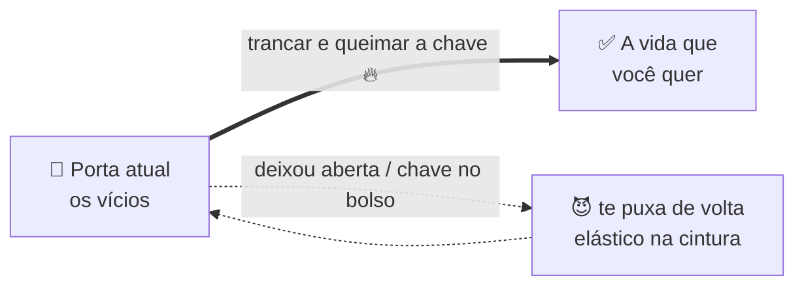
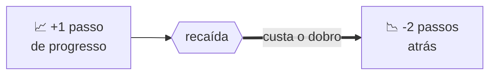
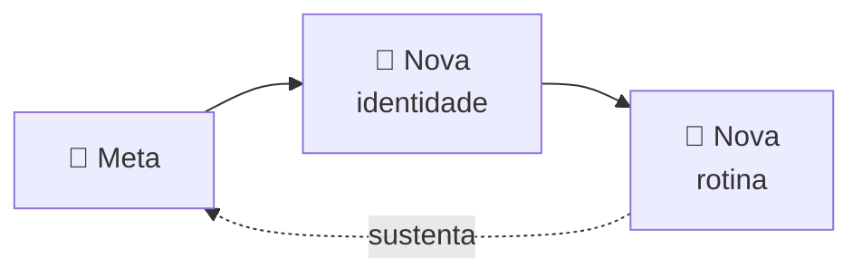
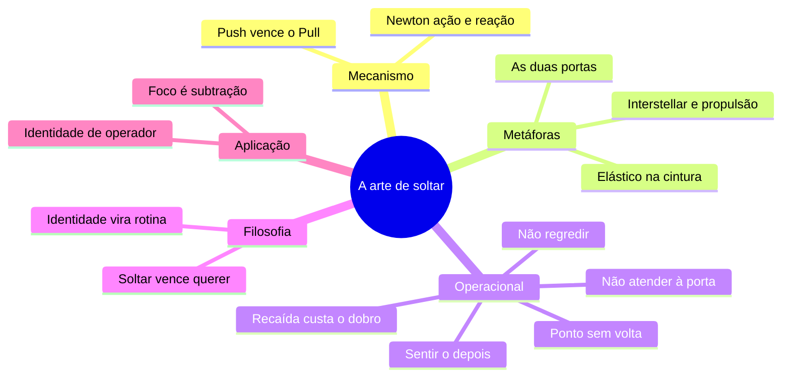

# Exemplo-ouro do formato

Um exemplo completo do formato em ação. Use como referência de **estrutura, sequência e acabamento visual** ao montar uma nota nova — mire neste nível de qualidade. Foi gerado a partir de um notebook do NotebookLM com uma única fonte (um vídeo de ~13 min).

> [!important] O que é reutilizável × o que é específico do autor
> **Reutilizável (imite):** a sequência (TL;DR → fonte → mecanismo → conceitos com Mermaid → operacional → filosofia → como aplicar → mapa → cola), o uso dos callouts, as tabelas comparativas, os diagramas Mermaid e a voz PT-BR direta.
>
> **Específico do autor (NÃO copie cego):** o frontmatter `tipo`/`hub`/`tags`, a seção "Onde aplico na Maven / AI Makers" (é a aplicação pessoal do dono do vault — troque por uma seção "Como aplicar" no contexto do **seu** usuário, ou omita), os `[[wikilinks]]` e a tag `#hub/well` no fim (são de um vault Obsidian específico). Numa nota genérica, use o **frontmatter mínimo** (`titulo`/`fonte`/`data`) e **não** adicione wikilinks nem hub-tags.

O conteúdo literal da nota, do começo ao fim:

````markdown
---
titulo: Aprendizados com Charlie Morgan
tipo: aprendizados
hub: well
tags: [aprendizados, charlie-morgan, disciplina, habitos, identidade, hub/well]
atualizado: 2026-06-10
---

# 🔑 Aprendizados com Charlie Morgan

> [!abstract] TL;DR — a arte de soltar
> Você não muda porque **quer** a meta. Você muda quando **fecha a porta, tranca e queima a chave** do que te puxa pra trás.
>
> **Mudança é subtração, não adição.**

> [!info] Quem é + de onde veio
> **Charlie Morgan** — empreendedor e coach britânico de agências/consultoria (programa gratuito de scale com ~60 mil alunos). Esta ficha destila o vídeo *"Give me 13 mins, I'll fix your addiction"* (notebook **"Ugly Addictions"**), onde ele conta como venceu videogame, junk food e pornografia — e revela o mecanismo por trás de **qualquer** mudança real.

---

## 🧠 O mecanismo: push × pull

> [!danger] A inversão que quase todo mundo erra
> Mudar **não** é "querer mais a meta". É decidir **o que você abandona**. Todo mundo aposta no *pull* (o puxão do desejo). O verdadeiro motor é o *push* — soltar o que te trava.

| | 🧲 Pull | 🔥 Push |
|---|---|---|
| **O que é** | Desejar a meta | Soltar o que te puxa pra trás |
| **Força** | Fraca, oscila | Forte, definitiva |
| **A pergunta** | "Quanto eu quero isso?" | "O que eu topo fechar a porta?" |
| **Quem foca aqui** | Quase todo mundo | Quem muda de verdade |



> [!quote] A física da coisa — Interstellar + Newton
> No vácuo, só avança quem **expele algo**: propulsão exige soltar. E pela 3ª lei de Newton, toda ação tem reação igual e oposta — pra **ganhar** algo, algo precisa **sair** e tomar o lugar.

---

## 🚪 As duas portas

A metáfora-assinatura do Charlie. Imagine **duas portas a 100 metros** uma da outra: você sai da porta atual (os vícios) e caminha rumo à porta da vida que quer.



> [!quote] Charlie Morgan
> "Você não decide ficar sarado, rico ou casado. Você decide **trancar a porta e jogar a chave fora** — sem cópia."

E é aqui que quase todo mundo falha: no **jeito** de fechar a porta.

| Estado da porta | O que acontece |
|---|---|
| 🚪 Aberta | O vício te alcança a qualquer hora |
| 🚪🔒 Fechada, sem trancar | Abre no primeiro impulso |
| 🚪🔑 Trancada, chave no bolso | Você mesmo reabre quando enfraquece |
| 🔥🔑 Trancada + chave queimada | **Ponto sem volta — é assim que muda** |

---

## ⚙️ Princípios operacionais

> [!tip] Não tente progredir — só não regrida
> Fazer o certo (treino, dieta) é fácil. O jogo é **não fazer o que te faz regredir**. É mais barato evitar o errado do que executar o certo. Mudança é **engenharia reversa**: ataque o que te puxa pra trás.

> [!warning] A matemática da recaída
> Cada recaída custa **2 passos pra trás**. Uma escorregada apaga vários avanços — por isso a porta tem que ficar trancada.



> [!example] Pontos sem volta do próprio Charlie
> - 🎮 Afogou o **Xbox na banheira** pra fritar o circuito.
> - ✂️ **Cortou pessoas**: mandou mensagem "desculpa, não dá mais pra sair" (e ninguém gosta disso).
> - 📱 Vícios integrados no dia a dia (short-form, porn, junk food) são mais difíceis de cortar fisicamente — mas o princípio é o mesmo: feche, tranque, **queime a chave**.

> [!danger] Quando o impulso bater na porta — não atenda
> Os impulsos vão voltar e bater. **Não vá catar a chave na grama** pra reabrir. Deixa bater.

E o filtro que desarma a tentação na hora:

| Momento | Como o vício se sente |
|---|---|
| ⏱️ **Durante** | Prazer, alívio, validação |
| 🕳️ **Depois** | Arrependimento — sempre |
| 🧭 **A regra** | Julgue pela sensação **de depois**, não pela do momento |

---

## 🧩 Aprendizados filosóficos



> [!abstract] Mudança = identidade = rotina
> "Não há mudança sem mudança de identidade; e não há mudança de identidade sem mudar a rotina." A meta exige **virar outra pessoa** — e virar outra pessoa exige **trocar o que você faz todo dia**.

- 🔄 **É sobre o que você solta, não sobre o que você quer.** Conquistar não é "fazer mais do certo" — é parar de se sabotar.
- 🪞 **Ele fala de dentro da experiência.** Venceu videogame, junk food e pornografia (fim da adolescência). E narra a própria virada amorosa: soltar a *lust* e as relações curtas (prazer e validação imediatos) pra buscar algo mais profundo — casamento, filhos, amor por uma só pessoa. **Fechar essa porta foi a condição pra abrir a outra.**

---

## 🎯 Onde aplico na Maven / AI Makers

> [!success] Tradução pro meu jogo
> - **Foco é subtração** — avançar no [[MavenOS]] é **fechar portas** (cortar frentes dispersas), não empilhar projetos.
> - **Identidade de operador/arquiteto** — adotar a rotina de quem eu já quero ser (reposicionamento "agentes de IA" → "arquitetura de sistemas"), em vez de só desejar o título.
> - **Filtro "como me sinto depois"** aplicado a hábitos de trabalho: doomscroll, notificação, troca de contexto.
> - **Pontos sem volta** como ferramenta de gestão: decisões irreversíveis (encerrar uma oferta, cortar um cliente errado) valem mais que força de vontade renovada todo dia.

---

## 🗺️ O framework num mapa



---

## 📌 Cola rápida

| Pilar | Em uma frase |
|---|---|
| 🧠 **Tese** | Mude fechando portas, não desejando metas |
| 🔁 **Mecanismo** | Push (soltar) vence Pull (querer) |
| ⚙️ **Tática** | Não regrida; torne a decisão irreversível |
| 🧭 **Filtro** | Julgue pelo "depois", não pelo "agora" |
| 🎯 **Aplicação** | Foco é subtração |

---

## 🔗 Hubs relacionados

- [[Well Pires]]
- [[Referências de empreendedorismo]]
- [[Aprendizados do Hormozi]]
- [[Aprendizados do Bernardinho]]

#hub/well
````
