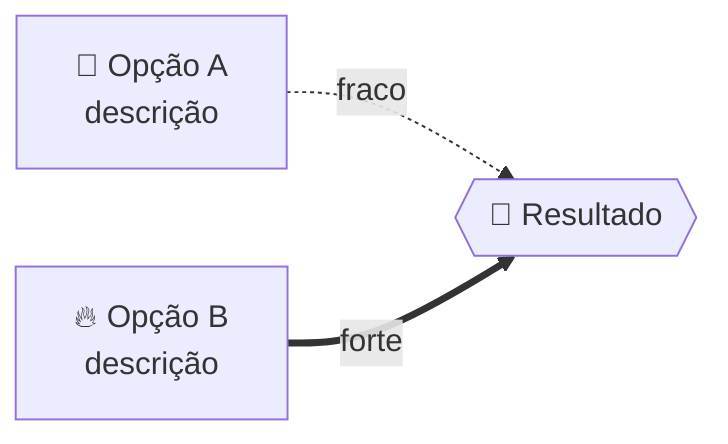
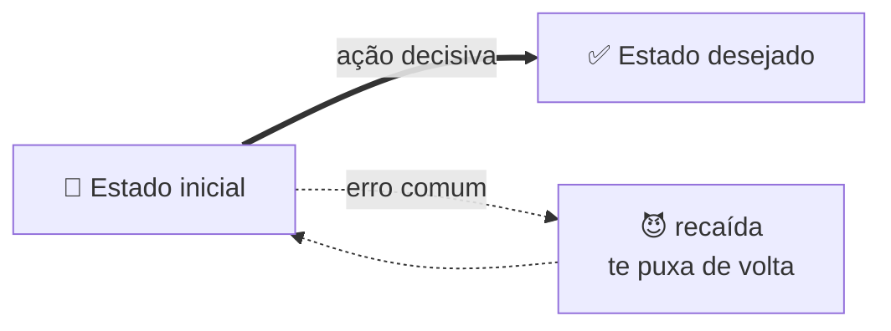
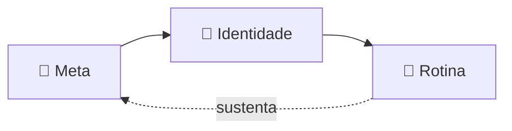
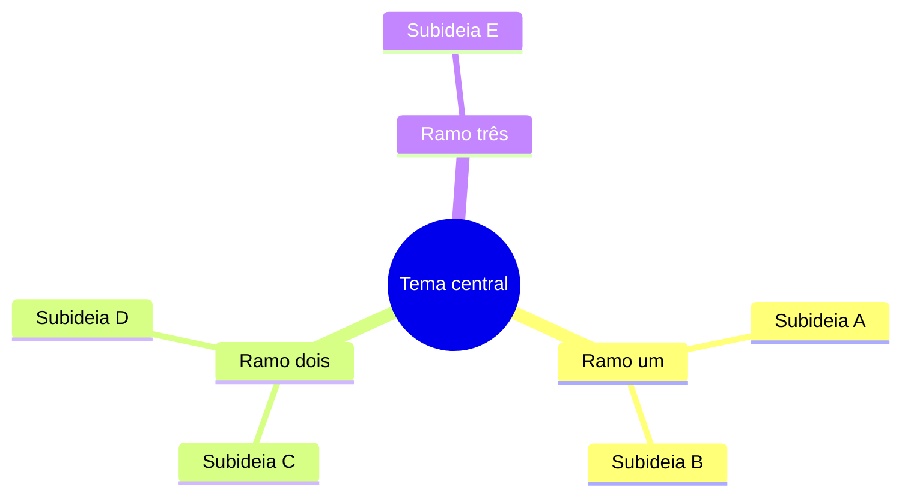

# Formato visual — a especificação

Este é o "nessa estrutura". O objetivo do formato é simples: pegar conhecimento (geralmente um vídeo/áudio/texto dentro de um notebook do NotebookLM) e deixá-lo **digerível, bonito e satisfatório de ler** — sem perder nada.

## Índice
1. Princípio da fidelidade
2. Frontmatter mínimo
3. A sequência lógica das seções
4. Voz e parágrafos
5. Catálogo de callouts
6. Padrões de tabela
7. Âncoras de emoji
8. Padrões de Mermaid + cuidados de sintaxe
9. Portabilidade por destino

---

## 1. Princípio da fidelidade

A nota é um destilado **fiel**, não um resumo raso. Antes de escrever, inventarie os conceitos da fonte (ideias, metáforas, números, exemplos, frases marcantes) e garanta que cada um reaparece. Na dúvida entre cortar e manter, mantenha. O formato existe pra deixar o conteúdo *mais* fácil de absorver — não pra encurtá-lo.

## 2. Frontmatter mínimo

Para destinos markdown (Obsidian ou `.md` solto), use um frontmatter enxuto e genérico:

```yaml
---
titulo: <título da nota>
fonte: <notebook / vídeo / autor de origem>
data: <AAAA-MM-DD>
---
```

Não adicione `tags`, `hub`, `aliases` ou campos de índice por conta própria. Se o usuário tiver um sistema próprio (ex.: um vault Obsidian com convenções), pergunte ou siga **só o que ele pedir**. No Notion, o frontmatter não se aplica — vira propriedades da página.

## 3. A sequência lógica das seções

A espinha dorsal (adapte os títulos ao conteúdo; **omita** o que não couber):

| # | Seção | Recurso visual típico |
|---|---|---|
| 1 | `# 🔖 Título` | H1 + emoji-âncora |
| 2 | TL;DR | `> [!abstract]` |
| 3 | Fonte / contexto | `> [!info]` |
| 4 | Ideia central / mecanismo | tabela comparativa e/ou diagrama |
| 5 | Conceitos / metáforas | **Mermaid** (flowchart) |
| 6 | Operacional ("como fazer") | callouts `tip` / `warning` / `example` |
| 7 | Camada profunda *(se houver)* | `> [!abstract]` + bullets |
| 8 | `## 🎯 Como aplicar` | bullets acionáveis (ou `> [!success]`) |
| 9 | `## 🗺️ Mapa` | **Mermaid** `mindmap` |
| 10 | `## 📌 Cola rápida` | tabela-resumo |

**Adapte ao tipo de conteúdo.** Um framework de mentalidade usa "mecanismo → metáforas → operacional → filosofia". Um tutorial técnico usa "o que é → passo a passo → armadilhas → quando usar". Uma entrevista usa "teses principais → argumentos → contrapontos". A *sequência* (visão geral → desenvolvimento visual → aplicação → mapa → cola) se mantém; os rótulos mudam.

Separe blocos grandes com `---` e feche sempre com a cola rápida — dá sensação de fechamento.

## 4. Voz e parágrafos

- **PT-BR**, direto, caloroso, com personalidade — "digerível e divertido", não acadêmico.
- Parágrafos curtos. Uma ideia por parágrafo. **Negrito** no termo-chave de cada ponto.
- Use a 2ª pessoa quando for instrução/aplicação ("você decide...", "comece por...").
- Cite frases de impacto da fonte como `> [!quote]` (com o autor), em vez de parafrasear tudo.
- Escreva na voz de quem está ensinando um amigo — sem floreio, sem encher linguiça.

## 5. Catálogo de callouts

Callouts são blockquotes com um marcador `> [!tipo]`. Use o tipo que combina com a função — a cor e o ícone ajudam a escanear:

| Callout | Use para |
|---|---|
| `> [!abstract]` | TL;DR no topo e o "mapa"/síntese |
| `> [!info]` | fonte/contexto (de onde veio o conhecimento) |
| `> [!quote]` | falas marcantes do autor (com atribuição) |
| `> [!tip]` | o hack, o atalho, a boa prática |
| `> [!warning]` | risco, pegadinha, erro comum |
| `> [!danger]` | a inversão crítica, o "não faça isso" |
| `> [!example]` | casos concretos, histórias, demonstrações |
| `> [!success]` | takeaways / como aplicar |

Sintaxe (cada linha começa com `> `; deixe uma linha `>` em branco entre parágrafos):

```markdown
> [!abstract] TL;DR — a ideia em uma frase
> O recado central, curto e direto.
>
> Um reforço opcional em outra linha.
```

Para listas dentro do callout, prefixe cada item com `> `:

```markdown
> [!example] Casos reais
> - Primeiro exemplo concreto.
> - Segundo exemplo concreto.
```

## 6. Padrões de tabela

Tabelas são ótimas para comparação e para a cola final. Padrões que funcionam bem:

- **Comparação A × B** (ex.: o jeito errado × o jeito certo, antes × depois).
- **Estados / níveis** (ex.: 4 estágios de algo → consequência de cada um).
- **Cola rápida**: 2 colunas — `Pilar | Em uma frase` — resumindo a nota inteira.

Use **negrito** na primeira coluna e emojis pra dar âncora visual.

## 7. Âncoras de emoji

Um emoji no começo de cada `##` cria pontos de fixação pro olho. Escolha emojis que *significam* a seção (🧠 mecanismo, 🚪/🧩 conceito, ⚙️ operacional, 🎯 aplicação, 🗺️ mapa, 📌 cola). Não exagere no corpo do texto — âncora nos títulos e marcadores pontuais bastam.

## 8. Padrões de Mermaid + cuidados de sintaxe

Mermaid renderiza nativamente no Obsidian e no Notion (code block). São os "gráficos" da nota. Use 2-4 por nota: um ou dois fluxos pros conceitos centrais e **sempre** um `mindmap` no fim.

### Cuidados que evitam diagrama quebrado
- **Quebra de linha em nó:** use `<br/>`, **nunca** `\n`.
- **Rótulos entre aspas** sempre que tiverem espaço, acento ou pontuação: `A["texto aqui"]`.
- **Rótulos de aresta:** `A -->|"texto"| B` (sólido) ou `A -.->|"texto"| B` (pontilhado) ou `A ==>|"texto"| B` (grosso).
- **No `mindmap`, evite caracteres especiais nos rótulos** (`( ) [ ] { } = : / < >`) — eles quebram o parser. Reformule ("Recaída: 2 passos" → "Recaída custa o dobro"). Acentos são OK.
- Mantenha simples. Diagrama que não renderiza é pior que diagrama nenhum.

### Template — fluxo de contraste (flowchart)


### Template — fluxo de processo / metáfora


### Template — cadeia / sequência


### Template — mindmap de fechamento (sempre rótulos limpos)


## 9. Portabilidade por destino

O mesmo conteúdo, sintaxe adaptada ao alvo:

| Recurso | Obsidian | `.md` solto | Notion |
|---|---|---|---|
| Mermaid | nativo ✅ | depende do viewer | code block `mermaid` ✅ |
| Callouts `> [!...]` | nativo ✅ | vira blockquote simples | mapear p/ **callout nativo** do Notion |
| Tabelas / emoji / blockquote | ✅ | ✅ | ✅ |
| Wikilinks `[[...]]` | só Obsidian | evite | não usar |
| Frontmatter YAML | ✅ | ✅ (inerte) | vira propriedades |

**Regra geral:** Obsidian e `.md` solto → markdown Obsidian-flavored (callouts + Mermaid). Notion → blocos nativos via conector (se disponível). Destino desconhecido → markdown portátil, ciente de que callouts degradam para blockquotes (continua legível). Nunca use `[[wikilinks]]` ou `#hub/tags` fora de um vault Obsidian que os use.
