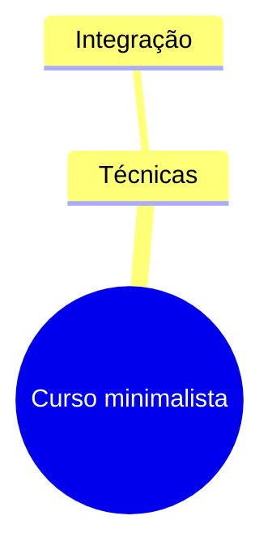

# Curso minimalista

## 1. Sumário Executivo

Síntese com integração e técnicas para o usuário.

## Mapa mental

## 2. Aplicações

Detalhes da aplicação.

## Neurônios conectáveis

- [Memória](/neurons/memoria.md)

## Resumos relacionados

- Nenhum resumo relacionado identificado.

## Fontes originais

- [Fonte técnica](https://example.com/fonte) · web_page